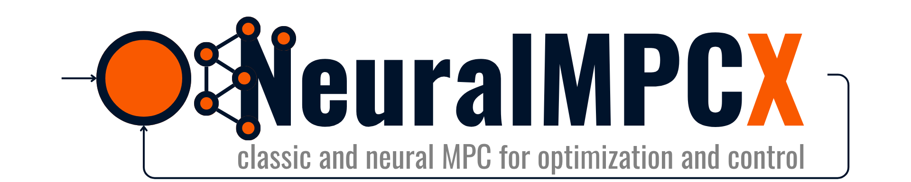

[](https://www.python.org/)
[](LICENSE.txt)
[](https://rodare.hzdr.de/badge/latestdoi/1180898465)

--------------------------------------------------------------------------------
NeuralMPCX is a Python library for building and deploying Model Predictive Controllers with classic and neural dynamical models. You write constrained MPC with RNN/LSTM models in a CasADi/IPOPT workflow. The library handles CasADi RNN integration, warm-starting, constraint management, real-time feasibility, and both LTI state-space and neural dynamics in one framework. You can run neural and classical MPC controllers side by side.

---

## Features

- [ ]  **Neural MPC** (RNN dynamic models)
- [ ]  Recurrent Neural Networks for system dynamics modelling
- [ ]  Classic MPC with CasADi-based optimization
- [ ]  Constraint handling (state, input, terminal, soft constraints)
- [ ]  Warm-starting & real-time iteration
- [ ]  Differentiable cost terms & custom regularization
- [ ]  Simulation utilities + logging

---

## Installation

> **Note:** NeuralMPCX is not yet available on PyPI. Install it locally from the downloaded repository.

### 1. Download or clone the repository

```bash
git clone https://github.com/hzdr/neural-mpcx.git
cd neural-mpcx
```

### 2. Install the package

**Basic install (core dependencies only):**

```bash
pip install -e .
```

**With PyTorch support** (for neural network training and deployment):

```bash
pip install -e .[torch]
```

This installs:
```
torch >= 2.0.0
torchvision >= 0.15.1
torchaudio >= 2.0.1
```

**For development** (testing, linting, type checking):

```bash
pip install -e .[dev]
```

### Dependencies

**Core Dependencies** (installed automatically):

```
numpy >= 1.26.4
casadi >= 3.6.6
joblib >= 1.4.2
gymnasium >= 0.29.1
scipy >= 1.10.0
matplotlib >= 3.5.0
pandas >= 1.5.0
```

### Manual PyTorch Installation

If you prefer to install PyTorch separately (e.g., to choose a specific CUDA version):

**CPU only:**
```bash
pip install torch>=2.0 torchvision>=0.15 torchaudio>=2.0 --index-url https://download.pytorch.org/whl/cpu
```

**NVIDIA GPU (CUDA 12.4, recommended for recent GPUs):**
```bash
pip install torch>=2.0 torchvision>=0.15 torchaudio>=2.0 --index-url https://download.pytorch.org/whl/cu124
```

> **WSL2 users:** GPU support works out of the box. Install the NVIDIA driver on **Windows** only (not inside WSL), then use the CUDA command above.

**Supported Python versions:**

- Python >= 3.9
- CasADi >= 3.6.6

Tested on Python 3.9, 3.10, 3.11, and 3.12.

---

## Getting Started

### Neural MPC

See [`examples/Cascaded_Two_Tank_System/neural_mpc_cts.py`](examples/Cascaded_Two_Tank_System/neural_mpc_cts.py) for a Neural MPC deployment. It reproduces an adapted version of the controller from [**[1]**](#1), tested on the Cascaded Two-Tank System (CTS) benchmark. [**[2]**](#2) describes the CTS in detail, and [**[3]**](#3) hosts the LSTM RNN training and test datasets.

### Classic Linear MPC

See [`examples/MPC_Grinding_Circuit/mpc_grinding_circuit.py`](examples/MPC_Grinding_Circuit/mpc_grinding_circuit.py) for a classic MPC deployment. It reproduces an adapted version of the controller from [**[4]**](#4): a constrained MPC for the 4x4 grinding circuit ($S_p,D_m,F_c,L_s$ as controlled outputs; $F_f,F_m,F_d,V_p$ as manipulated inputs).

The plant model is a discrete-time LTI state-space system ($A_d, B_d, C_d, D_d$), generated from the paper’s transfer-function matrix $G(s)$ with Pade dead-time approximations and ZOH discretization.

The original paper uses a step-response DMC. Here, the same problem is formulated as an NLP over a state-space model using CasADi/IPOPT (multi-shooting), with unified soft constraints via slacks and a large penalty $w$.

The paper’s 16 transfer functions $G_{ij}(s)$ are assembled into a single state-space model offline and discretized. The MPC uses this discrete SS model directly.

### Classic Nonlinear MPC

See [`examples/CSTR/nmpc_cstr.py`](examples/CSTR/nmpc_cstr.py) for a Nonlinear MPC (NMPC) controller on the Continuous Stirred Tank Reactor (CSTR) benchmark. Based on the do-mpc CSTR benchmark from [**[6]**](#6) (Fiedler et al., 2023), the reactor has two parallel reactions (A->B and B->C) and one side reaction (2A->D), controlled via feed flow rate and heat removal rate.

The plant model uses symbolic CasADi expressions with Arrhenius kinetics and 4th-order Runge-Kutta (RK4) integration, so the optimizer gets exact first-order derivatives. The NLP is formulated with CasADi/IPOPT (multi-shooting), soft state constraints via slack variables, and a quadratic stage and terminal cost.

The example also demonstrates output-feedback NMPC: only the reactor and jacket temperatures are measured online (as in a real plant, where concentrations require lab analysis), and an `ExtendedKalmanFilter` reconstructs the full state — including the unmeasured concentrations — from the noisy temperature measurements before each MPC solve.

A Neural MPC version of the same process is available at [`examples/CSTR/neural_mpc_cstr.py`](examples/CSTR/neural_mpc_cstr.py), where a trained LSTM replaces the explicit dynamics. You can compare physics-based NMPC against data-driven Neural MPC on the same benchmark.

### State Estimation with Kalman Filters

NeuralMPCX provides Kalman filter implementations for state and bias estimation in MPC applications:

```python
from neuralmpcx.util.estimators import AugmentedKalmanFilter
from neuralmpcx.util.control import mimo_tf2ss
import numpy as np

# Create state-space model from transfer functions
ss = mimo_tf2ss(G, ny=4, nu=4, Ts=30.0)

# Create augmented Kalman filter for bias estimation
kf = AugmentedKalmanFilter(
    Ad=ss.Ad, Bd=ss.Bd, Cd=ss.Cd, Dd=ss.Dd,
    Q_x=np.eye(ss.nx) * 0.1,   # Process noise for states
    Q_du=np.eye(ss.nu) * 0.01, # Process noise for input bias
    Q_dy=np.eye(ss.ny) * 0.01, # Process noise for output bias
    R=np.eye(ss.ny) * 1.0,     # Measurement noise
)

# In MPC loop
for t in range(T):
    kf.predict(u=dev_u)
    kf.update(y=y_measured - y_offset)

    # Pass bias estimates directly to MPC
    u_opt = mpc.solve_mpc(state=x_est, state_indices=state_indices,
                          dynamic_pars=kf.get_mpc_biases())
```

The `AugmentedKalmanFilter` estimates plant state, input bias, and output bias at the same time, so you get offset-free MPC tracking even with plant-model mismatch.

For nonlinear plants, the `ExtendedKalmanFilter` estimates the full state from partial, noisy measurements. It takes the discrete-time dynamics as a CasADi function — for example, the exact prediction model already registered on the MPC — and derives the Jacobians automatically via CasADi algorithmic differentiation (no finite differences):

```python
from neuralmpcx.util.estimators import ExtendedKalmanFilter
import numpy as np

# Only some outputs are measured online: y = C @ x
C = np.array([[0.0, 0.0, 1.0, 0.0],
              [0.0, 0.0, 0.0, 1.0]])

ekf = ExtendedKalmanFilter(
    f=mpc.dynamics,      # the same CasADi function used inside the NLP
    h=C,                 # or a casadi.Function h(x) -> y for nonlinear sensors
    Q=np.eye(4) * 1e-6,  # process noise
    R=np.eye(2) * 1e-5,  # measurement noise
    x0=x0_guess,
    P0=np.eye(4) * 0.05,
)

# In MPC loop
for t in range(T):
    u_opt = mpc.solve_mpc(state=ekf.x_est, state_indices=state_indices, ...)  # feed the estimate, not the true state
    y_meas = plant.measure()
    ekf.predict(u=u_opt)
    ekf.update(y=y_meas)
```

See [`examples/CSTR/nmpc_cstr.py`](examples/CSTR/nmpc_cstr.py) for a complete output-feedback NMPC deployment where the EKF reconstructs unmeasured reactor concentrations from temperature measurements alone.

## RNN-Based Dynamics in MPC

NeuralMPCX uses recurrent neural networks as internal dynamics models inside the MPC. Making this work required several adaptations:

- Converting PyTorch RNNs into CasADi
- Providing rolling context arrays of past actions and states (`action_context` and `state_context`, each `n_context` timesteps long) that feed the LSTM warmup
- Persisting the LSTM hidden/cell states across MPC solves

Only LSTM networks are supported so far.

An RNN's initial state, often set to zero, shapes its first predictions. In MPC, this initial state determines how the network reads the system's dynamics and how well it predicts future states. NeuralMPCX builds on the approach from [**[5]**](#5), where the predicted output $\hat{y}_k$ is part of the state:

$$
x_{k+1} = \mathcal{F} (x_k, \hat{y}_k,u_k;\theta_\mathcal{F}) \\\hat{y}_{k+1} = \mathcal{G} (x_{k+1}, \hat{y}_k,u_k;\theta_\mathcal{G})
$$

During training, the initial state is estimated from a window of past data $\{ y_{k-1}, \ldots, y_{k-N_c}, u_{k-1}, \ldots, u_{k-N_c} \}$: for $N_c$ steps, measured outputs $y_{k-i}$ are fed to the model instead of predicted ones (teacher forcing), and $x_{k-N_c}$ is set to zero. The model acts as its own state estimator, so training runs a joint backward pass over both estimation and forecasting.

At deployment, NeuralMPCX makes the LSTM **stateful**: its hidden and cell states $(h, c)$ persist on the `Mpc` instance across `solve_mpc()` calls and enter the optimization problem as plain NLP parameters `h0`/`c0`. The dynamics function `F(u, h0, c0)` simply unrolls the LSTM symbolically over the prediction horizon, driven by the controls and starting from these states — no state estimation happens inside the optimizer, which keeps the NLP graph small and the solve fast. (Past outputs are not an input to the rollout; they only seed `h0`/`c0` through the warmup below.)

Because the persisted $(h, c)$ already encode the current measurement, the neural NLP needs **no anchor column**: it spans exactly `T = prediction_horizon` columns, and every column `x[:, k]` is a genuine prediction rolled forward from `h0`/`c0` (the dynamics constraint is `x[:, :] == F(u, h0, c0)`). The most recent measurement and applied action survive only as the cost parameters `x0`/`u0` — used for terms like $\Delta u$ and initial/terminal penalties — and are **not** inputs to `F`. As a result, `solve_mpc()` applies `u[:, 0]` as the receding-horizon action and `x[:, 0]` is the first predicted future state. (Classic MPC instead keeps the usual anchor column `x[:, 0] == x0` and spans `prediction_horizon + 1` columns.)

### The warmup algorithm

The persisted $(h, c)$ are maintained numerically, outside the NLP, using **teacher forcing** — exactly mirroring how the network was trained:

1. **Teacher-forced context step.** For each context sample $(u_t, y_t)$, the layer-0 hidden state is *replaced by the measured output* $y_t$, the action $u_t$ is fed as input, and $(h, c)$ propagate through all layers. Each measurement therefore directly corrects the LSTM's memory.

2. **Hybrid warmup phase** (the first `n_warmup` solves). Each `solve_mpc()` call re-runs the teacher-forced pass over the *full* `n_context` window, *seeded with the previous solve's* $(h, c)$ (zeros on the very first solve). This blends fresh measurements with accumulated memory while the buffers settle.

3. **Steady-state phase** (after `n_warmup` solves). Each solve advances $(h, c)$ by exactly *one* teacher-forced step using the newest measured $(u, y)$ — O(1) work per solve instead of O(`n_context`).

4. **Inside the NLP.** The resulting $(h, c)$ are passed as the parameter values of `h0`/`c0`, and `F` rolls the LSTM forward symbolically over the prediction horizon from them.

5. **Recovery.** `mpc.reset_lstm_state()` zeros the buffers and the solve counter, forcing a fresh re-warmup from the rolling context arrays — use it if you suspect the persisted state has drifted from the plant. The `state_context`/`action_context` arrays act as the recovery truth data, so keep updating them every step.

In pseudocode:

```
on each solve_mpc(state_context, action_context, ...):
    if solve_count < n_warmup:
        (h, c) = estimate_numeric(u_ctx, y_ctx, seed=(h, c) or zeros)  # full window
    else:
        (h, c) = step_numeric(u_ctx[-1], y_ctx[-1], h, c)              # one step
    solve NLP with parameters h0 = h, c0 = c
    solve_count += 1
```

Setting this up takes three steps:

```python
from neuralmpcx.neural import CasadiLSTM

model = CasadiLSTM(
    n_context=10, n_inputs=1, hidden_size=128,
    horizon=10, proj_size=1,
)
model.load_state_dict(torch.load("model.pt"))

mpc.set_neural_dynamics(model=model, n_warmup=1)

# mpc.is_warmed_up        -> True once n_warmup solves have run
# mpc.reset_lstm_state()  -> force re-warmup from the context window
```

### Measured disturbances (feedforward)

A *measured disturbance* (feedforward variable) is an exogenous input you can measure but not manipulate. NeuralMPCX supports it in **both** the conventional and neural paths: declare it with `mpc.disturbance(name, size)` and it becomes a `(size, prediction_horizon)` NLP **parameter** that feeds the prediction model. At solve time `solve_mpc()` **holds the latest measured disturbance constant** across the prediction horizon by default (the industrial feedforward behavior). How you supply that measurement differs by mode: neural MPC takes a rolling `disturbance_context` window (it also feeds the LSTM warmup), while conventional MPC takes a single `disturbance` (the latest measurement). In either case, pass an explicit forecast via `dynamic_pars={<name>: (size, T)}` to override the hold-constant default.

**Neural MPC.** If you trained the LSTM on the disturbance channel `d` (input columns ordered `[u, d]`), pass `n_disturbances` to the model and `allow_disturbances=True` to `set_neural_dynamics`; the rollout then consumes `d` like the controls (`d` is a parameter, not a decision variable). Because the LSTM is stateful, `d` must also enter the numeric warmup, so here `disturbance_context` is a rolling window `(n_context, nd)` mirroring `state_context`/`action_context` (its last `n_context` rows seed `h0`/`c0`).

```python
model = CasadiLSTM(
    n_context=10, n_inputs=nu, n_disturbances=nd,   # core input is [u, d]
    hidden_size=128, horizon=10, proj_size=ny,
)
model.load_state_dict(torch.load("model.pt"))

mpc.disturbance("d", size=nd)                        # (nd, prediction_horizon) parameter
mpc.set_neural_dynamics(model=model, allow_disturbances=True, n_warmup=1)

# hold-constant default (no dynamic_pars["d"] needed)
u_opt = mpc.solve_mpc(state_context=state_context, state_indices=state_indices,
                      action_context=action_context, setpoint=setpoint,
                      disturbance_context=d_ctx)   # d_ctx: (n_context, nd)
```

**Conventional MPC.** The disturbance is wired into the step dynamics `F(x_k, u_k, d_k)`. There is no warmup, so you just pass the latest measurement as `disturbance`. It is optional: you may instead supply the full trajectory yourself via `dynamic_pars[<name>]`.

```python
mpc.disturbance("d", size=nd)                        # (nd, prediction_horizon) parameter
mpc.set_dynamics(F)                                  # F(x, u, d) -> x_next

# hold the latest measured disturbance constant over the horizon
u_opt = mpc.solve_mpc(state=state, state_indices=state_indices,
                      setpoint=setpoint, disturbance=d_meas)  # d_meas: (nd,)
```

## Project Structure

```
src/neuralmpcx/
  core/            # Cache, solutions, warmstart, debug
  multistart/      # Start point generation for warm-starting
  neural/          # LSTM/RNN integration with CasADi
  nlps/            # NLP building blocks (parameters, variables, constraints)
  util/            # Utilities: control, estimators, math, io
    control.py     # Transfer functions, state-space, LQR
    estimators.py  # Kalman filters for state estimation
  wrappers/        # MPC wrappers (Mpc)
  __init__.py      # __version__ here

examples/
```

---

---

## Testing

```bash
pip install -e ".[dev]"
ruff check src tests
mypy src
pytest -q
```

---

## Development Workflow

### Code Formatting and Linting

**Black** formats code. **Ruff** lints it.

#### Format Code with Black

```bash
# Check what would be reformatted
black --check src tests

# Format all code
black src tests

# Format specific files
black src/neuralmpcx/neural/casadi_lstm.py
```

#### Lint Code with Ruff

```bash
# Check all linting issues
ruff check src tests

# Auto-fix safe issues
ruff check --fix src tests

# Show what can be fixed
ruff check --fix --show-fixes src tests
```

#### Type Checking with mypy

```bash
# Run type checker
mypy src
```

#### Combined Workflow

Run all checks before committing:

```bash
# 1. Format with black
black src tests

# 2. Auto-fix with ruff
ruff check --fix src tests

# 3. Check remaining issues
ruff check src tests

# 4. Run type checking
mypy src

# 5. Run tests
pytest -q
```

### Pre-commit Hooks

Pre-commit hooks run these checks on every commit:

```bash
pre-commit install
pre-commit run --all-files
```

### Docstring Style

All public APIs use **NumPy-style docstrings**. Example:

```python
def my_function(param1, param2):
    """Brief description of the function.

    Extended description if needed.

    Parameters
    ----------
    param1 : type
        Description of param1.
    param2 : type
        Description of param2.

    Returns
    -------
    type
        Description of return value.
    """
```

---

---

## Contributing

Contributions are welcome. Follow these guidelines:

- Use `pre-commit` hooks (ruff/black/mypy/end-of-file-fixer)
- Follow **NumPy-style docstrings** for all public APIs (see Development Workflow section)
- Follow Conventional Commits (`feat:`, `fix:`, `docs:`, etc.)
- Open issues with minimal reproducible examples
- Run all tests and linting checks before submitting PRs

```bash
pre-commit install
```

---

## Citation

For academic work, cite:

```
@software{neuralmpcx2026,  title        = {NeuralMPCX: A Model Predictive Control library that supports classic MPC and neural MPC with CasADi},  author       = {Lopes Júnior, Ênio and Reinecke, Sebastian Felix},  year         = {2026},  url          = {https://github.com/hzdr/neural-mpcx}}
```

---

## License

**Apache License 2.0**. See [LICENSE.txt](./LICENSE.txt).

Portions derive from **casadi-nlp** by Filippo Airaldi, under the **MIT License**. See [LICENSE-MIT](./LICENSE-MIT).
Original project: [https://github.com/FilippoAiraldi/casadi-nlp](https://github.com/FilippoAiraldi/casadi-nlp)

[](LICENSE.txt)

---

## Maintainers & Contact

- Ênio Lopes Júnior
- Sebastian Felix Reinecke
- Issues: https://github.com/hzdr/neural-mpcx/issues

---

## Changelog

See [CHANGELOG.md](./CHANGELOG.md).

### References

<a id="1">[1]</a>
Adhau, S., Gros, S. and Skogestad, S. (2024).
["Reinforcement learning based MPC with neural dynamical models"](https://doi.org/10.1016/j.ejcon.2024.101048).
*European Journal of Control*, 80(A), 101048.

<a id="2">[2]</a>
Schoukens, M. and Noël, J. P. (2017).
[Three Benchmarks Addressing Open Challenges in Nonlinear System Identification](https://doi.org/10.1016/j.ifacol.2017.08.071).
*20th World Congress of the International Federation of Automatic Control*, Toulouse, France, July 9–14, 2017, pp. 448–453. ([preprint](https://drive.google.com/file/d/1vhn7udGe_anebb2-Wl94gcdZXeK6yxsK/view?usp=share_link))

<a id="3">[3]</a>
Schoukens, M., Mattsson, P., Wigren, T. and Noël, J. P.
[Cascaded tanks benchmark combining soft and hard nonlinearities](https://doi.org/10.4121/12960104).
4TU.ResearchData, Dataset.

<a id="4">[4]</a>
Chen, X. S., Zhai, J. Y., Li, S. H. and Li, Q. (2007).
["Application of model predictive control in ball mill grinding circuit"](https://doi.org/10.1016/j.mineng.2007.04.007).
*Minerals Engineering*, 20(11), 1099–1108.

<a id="5">[5]</a>
Forgione, M., Muni, A., Piga, D. and Gallieri, M. (2023).
["On the adaptation of recurrent neural networks for system identification"](https://doi.org/10.1016/j.automatica.2023.111092).
*Automatica*, 155, 111092.

<a id="6">[6]</a>
Fiedler, F., Karg, B., Lüken, L., Brandner, D., Heinlein, M., Brabender, F. and Lucia, S. (2023).
["do-mpc: Towards FAIR nonlinear and robust model predictive control"](https://doi.org/10.1016/j.conengprac.2023.105676).
*Control Engineering Practice*, 140, 105676.